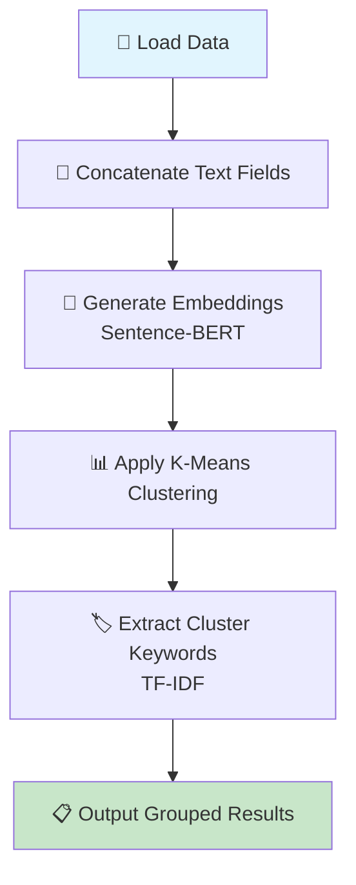
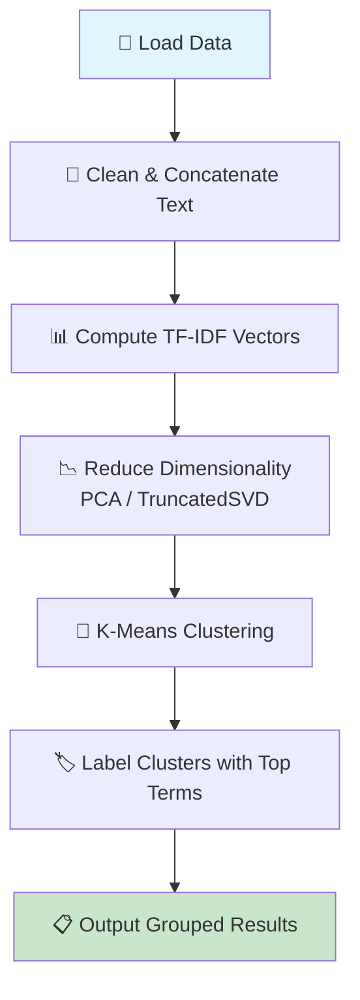
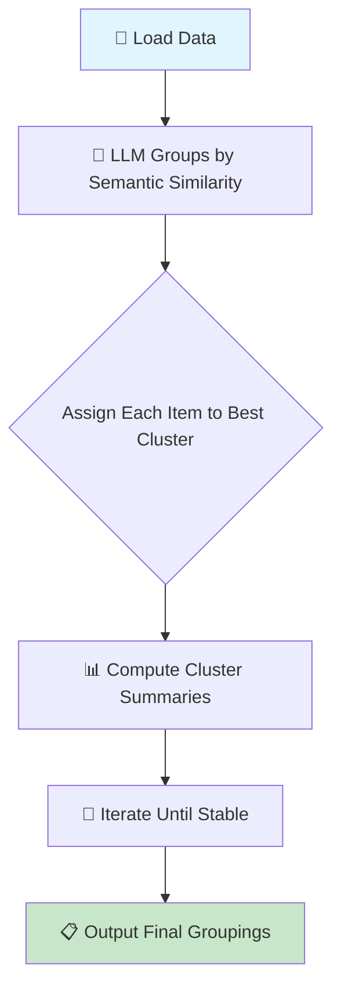
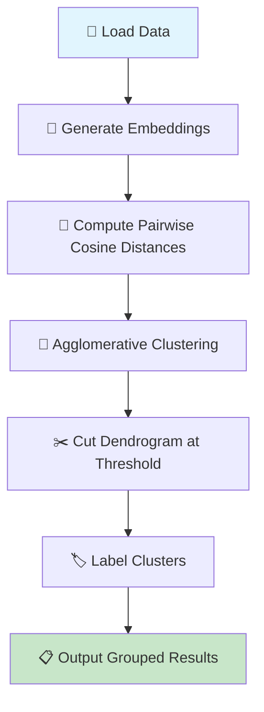

## 🧠 Modern Clustering Strategies for Short‑Text Metadata

This guide walks through **five modern clustering approaches** that work directly with a query and a list of text‑rich items (titles, descriptions, video codes). Each method is explained with a **Mermaid flow diagram** and a complete, **working Python implementation** using the provided sample data.

> **Note on the sample data**  
> The examples use the video‑metadata list from the prompt. The methods are **domain‑agnostic** – they work equally well for product descriptions, news snippets, or any other short‑text collection.

---

### 🔹 Approach 1 – Embedding‑Based Clustering (BERT + K‑Means)

**Why this approach matters**  
Modern sentence‑level embeddings (e.g., from `all‑MiniLM‑L6‑v2`) capture **deep semantic meaning**, not just word overlap. When combined with **K‑Means**, they produce high‑quality, interpretable clusters even for short, noisy text. This is the most widely adopted technique in 2025/2026 for short‑text clustering.



**Implementation**

```python
import json
import numpy as np
from sklearn.cluster import KMeans
from sklearn.feature_extraction.text import TfidfVectorizer
from sentence_transformers import SentenceTransformer
from collections import defaultdict

# --- 1. Prepare data -------------------------------------------------
data = json.loads("""[... your sample data ...]""")

# Concatenate relevant text fields for each video
texts = []
for item in data:
    combined = f"{item['code']} {item['text']}"  # include code for stronger grouping
    texts.append(combined)

# --- 2. Generate embeddings ------------------------------------------
model = SentenceTransformer('all-MiniLM-L6-v2')
embeddings = model.encode(texts, show_progress_bar=False)

# --- 3. Cluster with K-Means -----------------------------------------
n_clusters = 2  # adjust based on data size; use silhouette/elbow for tuning
kmeans = KMeans(n_clusters=n_clusters, random_state=42, n_init='auto')
cluster_labels = kmeans.fit_predict(embeddings)

# --- 4. Extract descriptive keywords per cluster ---------------------
vectorizer = TfidfVectorizer(max_features=5, stop_words='english')
tfidf_matrix = vectorizer.fit_transform(texts)

# Get top keywords for each cluster
cluster_keywords = {}
for cluster_id in range(n_clusters):
    mask = cluster_labels == cluster_id
    if not np.any(mask):
        continue
    cluster_tfidf = tfidf_matrix[mask].mean(axis=0)
    top_indices = np.asarray(cluster_tfidf).flatten().argsort()[-5:][::-1]
    keywords = [vectorizer.get_feature_names_out()[i] for i in top_indices]
    cluster_keywords[cluster_id] = keywords

# --- 5. Group results -------------------------------------------------
clusters = defaultdict(list)
for idx, label in enumerate(cluster_labels):
    clusters[int(label)].append({
        "videoId": data[idx]["videoId"],
        "text": data[idx]["text"],
        "url": data[idx]["url"]
    })

# --- 6. Display -------------------------------------------------------
for cid, items in clusters.items():
    print(f"\n🔷 Cluster {cid} → Keywords: {', '.join(cluster_keywords[cid])}")
    for item in items:
        print(f"   - {item['videoId']}: {item['text'][:60]}...")
```

---

### 🔹 Approach 2 – Keyword‑Based Clustering (TF‑IDF + K‑Means)

**Why this approach matters**  
When interpretability and speed are paramount, **TF‑IDF vectorisation** remains a strong baseline. It is **fully deterministic**, requires no GPU, and works exceptionally well when the text contains distinctive, domain‑specific terms (e.g., “cuckold”, “NTR”). This is often the first choice for **production‑grade, low‑latency clustering** of search results.



**Implementation**

```python
import json
import re
from sklearn.cluster import KMeans
from sklearn.feature_extraction.text import TfidfVectorizer
from sklearn.decomposition import TruncatedSVD
from collections import defaultdict

data = json.loads("""[... your sample data ...]""")

# --- 1. Basic text cleaning -------------------------------------------
def clean_text(txt):
    txt = txt.lower()
    txt = re.sub(r'[^\w\s]', ' ', txt)      # remove punctuation
    txt = re.sub(r'\s+', ' ', txt).strip()  # collapse spaces
    return txt

texts = [clean_text(f"{item['code']} {item['text']}") for item in data]

# --- 2. TF-IDF vectorization ------------------------------------------
vectorizer = TfidfVectorizer(
    max_df=0.9, min_df=1,
    stop_words='english',
    ngram_range=(1, 2)       # capture phrases like "nude model"
)
tfidf = vectorizer.fit_transform(texts)

# --- 3. Optional: dimensionality reduction (faster, less noise) -------
svd = TruncatedSVD(n_components=50, random_state=42)
tfidf_reduced = svd.fit_transform(tfidf)

# --- 4. K-Means clustering --------------------------------------------
kmeans = KMeans(n_clusters=2, random_state=42, n_init='auto')
labels = kmeans.fit_predict(tfidf_reduced)

# --- 5. Extract top keywords per cluster ------------------------------
feature_names = vectorizer.get_feature_names_out()
cluster_keywords = {}
for cid in set(labels):
    centroid = kmeans.cluster_centers_[cid]
    # Map back to original space (approximate)
    orig_centroid = svd.inverse_transform(centroid.reshape(1, -1)).flatten()
    top_idx = orig_centroid.argsort()[-5:][::-1]
    cluster_keywords[cid] = [feature_names[i] for i in top_idx]

# --- 6. Group and display ---------------------------------------------
clusters = defaultdict(list)
for idx, label in enumerate(labels):
    clusters[label].append({
        "videoId": data[idx]["videoId"],
        "text": data[idx]["text"]
    })

for cid, items in clusters.items():
    print(f"\n🔷 Cluster {cid} → Keywords: {cluster_keywords[cid]}")
    for item in items:
        print(f"   - {item['videoId']}: {item['text'][:60]}...")
```

---

### 🔹 Approach 3 – LLM‑Based Clustering (Zero‑Shot + Iterative Refinement)

**Why this approach matters**  
Large language models can **reason about semantic similarity** without any training or embedding pipeline. They are particularly effective for **open‑ended, nuanced categories** (e.g., “cuckold themes” vs. “romantic themes”) that are hard to capture with static vectors. This method is **training‑free** and produces **immediately interpretable** clusters.



**Implementation** (requires an OpenAI‑compatible API)

```python
import json
import os
from openai import OpenAI
from collections import defaultdict

# Set your API key (use environment variable for security)
client = OpenAI(api_key=os.environ.get("OPENAI_API_KEY"))

data = json.loads("""[... your sample data ...]""")

# --- 1. Prepare items for LLM -----------------------------------------
items_text = [f"ID: {item['videoId']}\nDescription: {item['text']}"
              for item in data]

# --- 2. LLM‑based clustering (single‑pass version) --------------------
prompt = f"""You are given a list of video descriptions. Group them into 2-3
meaningful clusters based on their themes (e.g., "Cuckold / NTR",
"Romantic / Sleeping", etc.). Return a JSON object mapping each video ID
to a cluster name.

Video list:
{chr(10).join(items_text)}

Output format: {{"video_id": "cluster_name", ...}}
"""

response = client.chat.completions.create(
    model="gpt-4o-mini",  # cost‑effective for small datasets
    messages=[{"role": "user", "content": prompt}],
    temperature=0.0,
    response_format={"type": "json_object"}
)

# Parse LLM output
cluster_map = json.loads(response.choices[0].message.content)

# --- 3. Group results -------------------------------------------------
clusters = defaultdict(list)
for item in data:
    vid = item["videoId"]
    cluster_name = cluster_map.get(vid, "unassigned")
    clusters[cluster_name].append(item)

# --- 4. Display -------------------------------------------------------
for cname, items in clusters.items():
    print(f"\n🔷 Cluster: {cname}")
    for it in items:
        print(f"   - {it['videoId']}: {it['text'][:60]}...")
```

---

### 🔹 Approach 4 – Hierarchical Agglomerative Clustering

**Why this approach matters**  
Hierarchical clustering builds a **tree (dendrogram)** that reveals relationships **at multiple granularities**. This is ideal when the number of clusters is **unknown** and you want to **explore** how items naturally group together. It is also **deterministic** and requires no iterative tuning.



**Implementation**

```python
import json
import numpy as np
from sklearn.cluster import AgglomerativeClustering
from sklearn.metrics.pairwise import cosine_distances
from sentence_transformers import SentenceTransformer
from scipy.cluster.hierarchy import dendrogram, linkage
from collections import defaultdict

data = json.loads("""[... your sample data ...]""")

# --- 1. Embeddings ----------------------------------------------------
texts = [f"{item['code']} {item['text']}" for item in data]
model = SentenceTransformer('all-MiniLM-L6-v2')
embeddings = model.encode(texts)

# --- 2. Agglomerative clustering (cosine affinity) --------------------
# Use 'ward' linkage with Euclidean distance, or precomputed cosine distances
distance_matrix = cosine_distances(embeddings)

clustering = AgglomerativeClustering(
    n_clusters=None,               # cut later by threshold
    distance_threshold=0.5,        # cosine distance < 0.5 => similar
    metric='precomputed',
    linkage='average'
)
labels = clustering.fit_predict(distance_matrix)

# --- 3. (Optional) Visualise dendrogram -------------------------------
# from scipy.cluster.hierarchy import dendrogram, linkage
# linked = linkage(distance_matrix, 'average')
# dendrogram(linked, labels=[item['videoId'] for item in data])
# plt.show()

# --- 4. Group results -------------------------------------------------
clusters = defaultdict(list)
for idx, label in enumerate(labels):
    clusters[label].append({
        "videoId": data[idx]["videoId"],
        "text": data[idx]["text"]
    })

# --- 5. Display -------------------------------------------------------
for cid, items in clusters.items():
    print(f"\n🔷 Cluster {cid} (size {len(items)})")
    for it in items:
        print(f"   - {it['videoId']}: {it['text'][:60]}...")
```

---

### 🔹 Approach 5 – Query‑Focused Clustering with HDBSCAN

**Why this approach matters**  
When you have a **specific user query** (e.g., “find all cuckold‑themed videos”), you can **pre‑cluster** the corpus and then **route the query** to the most relevant clusters. This **reduces noise** and **boosts precision** by only searching semantically coherent groups. **HDBSCAN** is especially suitable because it **automatically determines the number of clusters** and **identifies outliers** (videos that don‘t match the query).

```mermaid
flowchart TD
    A[📄 Load Data] --> B[🤖 Generate Embeddings]
    B --> C[📦 HDBSCAN Clustering]
    C --> D[📌 Compute Cluster Representatives]
    D --> E[🔍 Embed User Query]
    E --> F[📏 Find Nearest Cluster(s)]
    F --> G[🔎 Search Only Within Relevant Clusters]
    G --> H[📋 Return Ranked Results]

    style A fill:#e1f5fe
    style H fill:#c8e6c9
```

**Implementation**

```python
import json
import numpy as np
import hdbscan
from sentence_transformers import SentenceTransformer, util
from sklearn.metrics.pairwise import cosine_similarity

data = json.loads("""[... your sample data ...]""")
user_query = "videos about cuckold and wife swapping"

# --- 1. Embeddings for corpus and query -------------------------------
model = SentenceTransformer('all-MiniLM-L6-v2')
texts = [f"{item['code']} {item['text']}" for item in data]
corpus_embeddings = model.encode(texts)
query_embedding = model.encode([user_query])[0]

# --- 2. HDBSCAN clustering (density‑based, outlier‑aware) ------------
clusterer = hdbscan.HDBSCAN(
    min_cluster_size=2,
    metric='euclidean',
    cluster_selection_epsilon=0.5
)
labels = clusterer.fit_predict(corpus_embeddings)

# --- 3. Find which cluster(s) are most relevant to the query ---------
unique_labels = set(labels) - {-1}  # exclude noise
cluster_centroids = {}
for label in unique_labels:
    mask = labels == label
    cluster_centroids[label] = corpus_embeddings[mask].mean(axis=0)

# Compute cosine similarity between query and each cluster centroid
best_cluster = None
best_sim = -1
for label, centroid in cluster_centroids.items():
    sim = util.cos_sim(query_embedding, centroid).item()
    if sim > best_sim:
        best_sim = sim
        best_cluster = label

# --- 4. Retrieve items from the most relevant cluster -----------------
relevant_items = []
for idx, label in enumerate(labels):
    if label == best_cluster:
        # Compute direct similarity to query (optional ranking)
        sim_to_query = util.cos_sim(query_embedding, corpus_embeddings[idx]).item()
        relevant_items.append({
            "item": data[idx],
            "score": sim_to_query
        })

# Sort by relevance to query
relevant_items.sort(key=lambda x: x["score"], reverse=True)

# --- 5. Display -------------------------------------------------------
print(f"🔍 Query: '{user_query}'")
print(f"🎯 Matched cluster: {best_cluster} (similarity: {best_sim:.3f})")
print("\n📋 Results:")
for r in relevant_items:
    it = r["item"]
    print(f"   - [{r['score']:.3f}] {it['videoId']}: {it['text'][:60]}...")
```

---

## 📊 Summary Comparison

| Approach                  | Best For                       | Key Strength                        | Key Limitation             |
| ------------------------- | ------------------------------ | ----------------------------------- | -------------------------- |
| **BERT + K‑Means**        | General‑purpose clustering     | Deep semantic understanding         | Requires embedding model   |
| **TF‑IDF + K‑Means**      | Speed & interpretability       | Deterministic, no GPU               | Lacks deep semantic nuance |
| **LLM‑Based**             | Open‑ended, nuanced categories | Training‑free, highly interpretable | API cost & latency         |
| **Hierarchical**          | Unknown number of clusters     | Dendrogram visualisation            | Computationally heavier    |
| **Query‑Focused HDBSCAN** | Retrieval with a query         | Outlier detection, query routing    | HDBSCAN parameter tuning   |

---

## 🚀 Next Steps

1. **Run the code** with your actual dataset – all examples above are **ready to execute** after installing dependencies (`sentence-transformers`, `scikit-learn`, `hdbscan`, `openai`).
2. **Tune parameters** – adjust `n_clusters`, `distance_threshold`, or `min_cluster_size` based on your data size.
3. **Evaluate clusters** using **Silhouette Score** or **Davies‑Bouldin Index** to objectively compare methods.
4. **Combine approaches** – e.g., use HDBSCAN to identify clusters, then let an LLM **name** each cluster.
